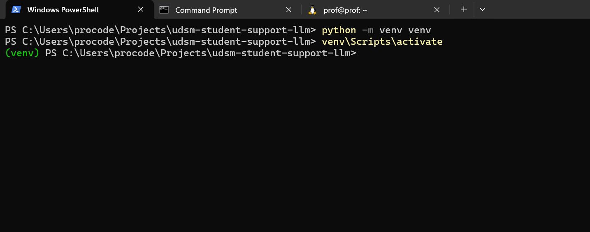
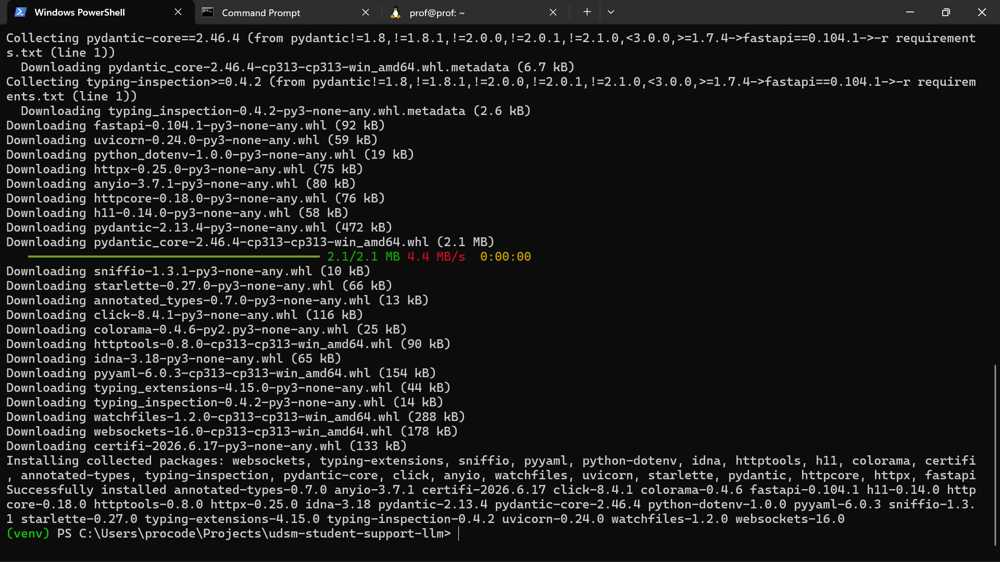
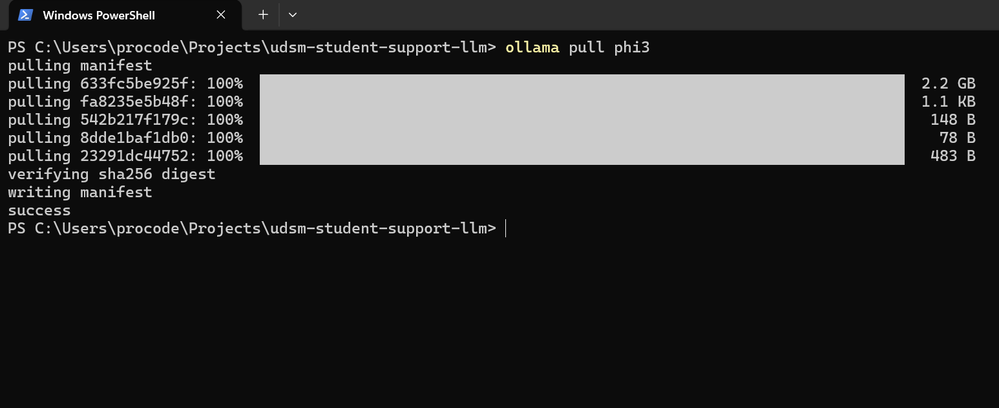
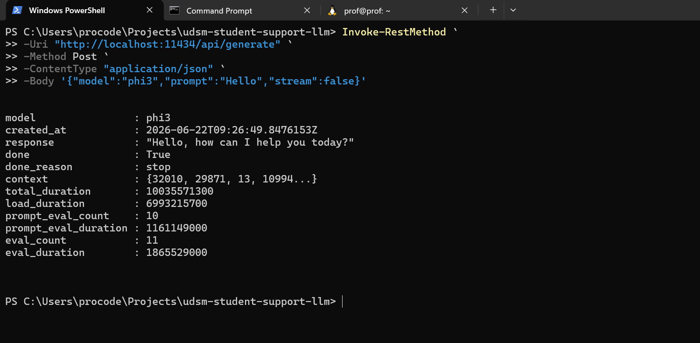
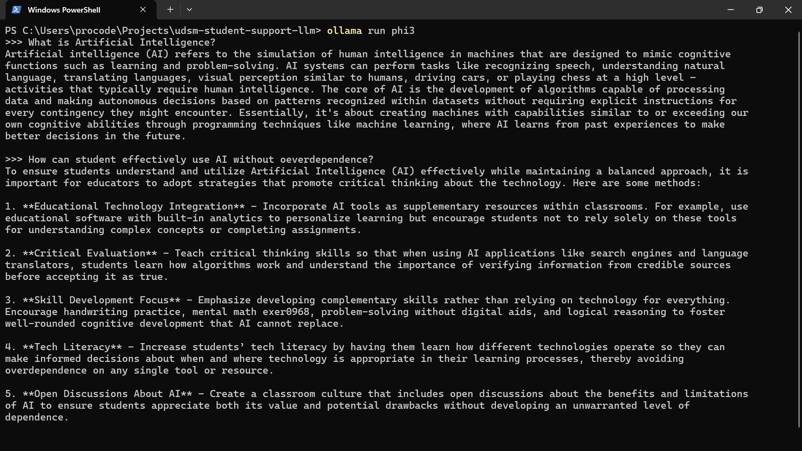

# UDSM Student Support Assistant

An AI-powered student support chatbot for the **University of Dar es Salaam**, built on a fully self-hosted LLM pipeline. Students can ask questions about university services — course registration, examinations, hostels, fees, library, ICT support, and more — and receive real-time streaming answers entirely on local infrastructure, with no external API calls.

---

## Features

- **Real-time streaming** — responses stream token-by-token via Server-Sent Events (SSE); no waiting for the full answer
- **JWT authentication** — secure register/login; every chat session is tied to a verified user account
- **Persistent chat history** — all sessions stored in MongoDB; history survives page refresh and is restored on next login
- **Multi-session sidebar** — create new chats, switch between past sessions; titles auto-generated by the LLM
- **Response evaluation** — users can rate any answer 1–5 stars; ratings saved for analysis
- **Dark / light theme** — persisted to `localStorage`
- **Structured UDSM scope** — system prompt constrains the model to university topics; off-topic queries are redirected
- **Logging** — every question, answer, and error written to `backend/logs/app.log` with timestamps
- **API test suite** — `tests/test_api.py` covers all endpoints with pass/fail output

---

## Tech Stack

| Layer | Technology |
|---|---|
| LLM model | phi3:latest (Microsoft Phi-3 Mini, 3.8 B params) |
| LLM runtime | Ollama |
| Backend | FastAPI 0.104 · Python 3.12 |
| Web server | Uvicorn 0.24 |
| Async HTTP client | httpx 0.25 |
| Database | MongoDB 8.0 (Docker) · Motor 3.7 async driver |
| Authentication | python-jose (JWT HS256) · passlib + bcrypt |
| Frontend | React 19 · Vite 8 · Tailwind CSS v4 |
| Routing | React Router DOM v7 |
| Icons | Lucide React |
| Markdown rendering | react-markdown + remark-gfm |

---

## System Architecture

```
┌──────────────────────────────────────────────────────────────┐
│                    Student  (browser)                        │
└────────────────────────┬─────────────────────────────────────┘
                         │  HTTP · SSE · Bearer JWT
┌────────────────────────▼─────────────────────────────────────┐
│              React Frontend   (Vite · :5173)                 │
│  /login   /register   /chat                                  │
└────────────────────────┬─────────────────────────────────────┘
                         │  fetch() / SSE stream
┌────────────────────────▼─────────────────────────────────────┐
│              FastAPI Backend   (Uvicorn · :8000)             │
│                                                              │
│  /auth/register  /auth/login                                 │
│  /ask            → StreamingResponse (SSE)                   │
│  /history/{id}   /sessions   /feedback   /model-info        │
│                                                              │
│  ┌─────────────────────┐   ┌──────────────────────────────┐  │
│  │  Motor (async)      │   │  httpx (async)               │  │
│  │  MongoDB · :27017   │   │  Ollama  · :11434            │  │
│  │  sessions           │   │  phi3:latest                 │  │
│  │  users              │   │  stream: True                │  │
│  │  feedback           │   └──────────────────────────────┘  │
│  └─────────────────────┘                                     │
└──────────────────────────────────────────────────────────────┘
```

---

## Top-Level Structure

```
udsm-student-support-llm/
│
├── backend/                 # FastAPI application
│   ├── api/api.py           # All route handlers
│   ├── auth.py              # JWT + bcrypt helpers
│   ├── config.py            # Env var loading
│   ├── llm_client.py        # Ollama streaming + title generation
│   ├── main.py              # App factory, CORS, lifespan
│   ├── database/            # Motor CRUD + schemas
│   ├── models/              # Pydantic request/response models
│   └── logs/                # Logger setup + app.log
│
├── frontend/                # React + Tailwind web app
│   └── src/
│       ├── App.jsx          # Router setup
│       ├── pages/           # LoginPage, RegisterPage, ChatPage
│       ├── components/      # chat/, sidebar/, layout/
│       ├── contexts/        # AuthContext, ChatContext, ThemeContext
│       ├── services/api.js  # fetch wrappers + SSE generator
│       └── hooks/ utils/    # useAutoScroll, cn, format
│
├── mongoDB/
│   └── docker-compose.yml   # MongoDB 8.0 container
│
├── tests/
│   └── test_api.py          # API test script (Python requests)
│
├── docs/
│   └── report.md            # Assignment report guide
│
├── screenshots/             # Evidence screenshots
├── requirements.txt         # Python dependencies
└── README.md
```

---

## Prerequisites

Install all of the following before starting:

| Requirement | Version | Notes |
|---|---|---|
| Python | 3.10 + | `python --version` |
| Node.js | 18 + | `node --version` |
| Docker Desktop | Latest | For MongoDB container |
| Ollama | Latest | [ollama.com](https://ollama.com) |
| Git | Any | Optional but recommended |

---

## Quick Start

### 1 — Clone the repository

```bash
git clone <repository-url>
cd udsm-student-support-llm
```

### 2 — Create and activate Python virtual environment

```bash
python -m venv venv

# Windows
venv\Scripts\activate

# macOS / Linux
source venv/bin/activate
```



### 3 — Install Python dependencies

```bash
pip install -r requirements.txt
```



### 4 — Pull the phi3 model

```bash
ollama pull phi3:latest
```



### 5 — Start MongoDB

```bash
cd mongoDB
docker compose up -d
cd ..
```

Verify it is running:

```bash
docker ps   # should show udsm_mongodb container
```

### 6 — Configure environment variables

Copy the example files and fill in real values:

```bash
# Windows
copy backend\.env.example backend\.env
copy mongoDB\.env.example mongoDB\.env

# macOS / Linux
cp backend/.env.example backend/.env
cp mongoDB/.env.example mongoDB/.env
```

Edit `backend/.env`:
- Set `MONGODB_URL` using the username and password from `mongoDB/.env`
- Generate a strong `SECRET_KEY`: `python -c "import secrets; print(secrets.token_hex(32))"`

See [backend/README.md](backend/README.md) for the full variable reference.

### 7 — Start the backend

```bash
# From the project root with venv active
uvicorn backend.main:app --reload --port 8000
```

Open **http://localhost:8000/docs** to verify the Swagger UI is available.

### 8 — Start the frontend

```bash
cd frontend
npm install        # first time only
npm run dev
```

Open **http://localhost:5173** — you will see the login page.

### 9 — Verify Ollama is serving the model

```bash
ollama run phi3
```

Or confirm via the REST API:



---

## Environment Variables

### Backend (`backend/.env`)

| Variable | Default | Description |
|---|---|---|
| `LLM_MODEL` | `phi3:latest` | Ollama model name |
| `LLM_API_URL` | `http://localhost:11434/api/chat` | Ollama chat endpoint |
| `MONGODB_URL` | *(see `.env.example`)* | MongoDB connection string — must match `mongoDB/.env` credentials |
| `MONGODB_DB` | `udsm_db` | Database name |
| `SECRET_KEY` | *(required — no safe default)* | JWT signing key — generate with `python -c "import secrets; print(secrets.token_hex(32))"` |
| `ACCESS_TOKEN_EXPIRE_MINUTES` | `1440` | Token lifetime (24 h) |
| `MAX_HISTORY` | `20` | Max messages stored per session |
| `CONTEXT_WINDOW` | `10` | Messages sent to Ollama per request |
| `MAX_CONCURRENT` | `3` | Max simultaneous Ollama inferences |
| `SESSION_TTL_DAYS` | `7` | Days before unused sessions expire |

### Frontend (`frontend/.env`)

| Variable | Default | Description |
|---|---|---|
| `VITE_API_URL` | `http://localhost:8000` | Backend base URL |

---

## API Endpoints

| Method | Path | Auth | Description |
|---|---|---|---|
| `GET` | `/health` | — | Service status, session count, queue depth |
| `GET` | `/model-info` | — | Model config and capabilities |
| `POST` | `/auth/register` | — | Create account → returns JWT |
| `POST` | `/auth/login` | — | Authenticate → returns JWT |
| `POST` | `/ask` | Optional | Stream SSE tokens from phi3 |
| `GET` | `/history/{session_id}` | Optional | Retrieve message history |
| `DELETE` | `/history/{session_id}` | Optional | Clear one session |
| `DELETE` | `/history` | Required | Clear all sessions |
| `GET` | `/sessions` | Required | List authenticated user's sessions |
| `POST` | `/feedback` | Optional | Submit 1–5 star rating |

Full interactive documentation: **http://localhost:8000/docs**

---

## Running the Test Suite

With the backend running:

```bash
python tests/test_api.py
```

The script creates a temporary test user, exercises every endpoint, checks error handling, and cleans up after itself. All results are printed with ✓ / ✗ indicators and a final summary line.

---

## Running Ollama

```bash
# Start Ollama service (if not already running as a system service)
ollama serve

# In a separate terminal — interactive chat to verify the model
ollama run phi3
```



---

## Project Structure Details

- [backend/README.md](backend/README.md) — module reference, env vars, API, logging, database
- [frontend/README.md](frontend/README.md) — component tree, routes, state management, commands
- [docs/report.md](docs/report.md) — IS 365 assignment report guide with reflection answers
